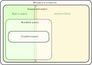

# Asset Terminology and Implementation

We divide assets into categories depending on how they are visible to the codebase. These categories are _supported_, _available_ and _enabled_ assets. Following is a diagram describing the relationship between asset categories where each group is a subset of the next one (e.g. enabled assets is a subset of available assets):

Besides the categories mentioned above there are some other important asset groupings that are either subsets of the above categories or distributed throughout all categories.

## Terminology

### Base Asset

A _base asset_ is the primary native asset of a given blockchain, e.g. ETH on ethereum, SOL on solana, etc.

### Token

Tokens are assets within a given blockchain that are not the base asset. An example token is USDC on the Ethereum network. Tokens always have some kind of unique identifier on their blockchain. On the Ethereum network the identifier is the token's contract address. On Algorand it is the "asset index" (which is an integer value), on Cardano it is a combination of "policy identifier" and "asset name".

### All assets

This category represents all assets in existence. We do not specifically have a category called "all assets" and in many cases by "all assets" we mean "all supported assets".

### Supported

An asset is _supported_ if it exists in the runtime assets registry statically or in the Custom Tokens Registry. Tokens can be added to the Custom Tokens Registry dynamically during runtime, effectively moving from the set of "all assets" to "supported assets" during runtime.

Supported assets can be thought of also as "supported networks", where the base asset represents the network. Each supported network is coded as an _asset plugin_, that contains all the metadata and code needed to use an asset in a wallet. The asset plugin is responsible for creating _asset objects_, that represent assets in code. Asset Objects hold metadata and code related to a given asset or network.

#### Built-in

Supported assets that exist in the runtime assets registry statically are referred to as _built-in_ assets.

#### Custom Tokens

Tokens that reside in the Custom Tokens Registry are called _Custom Tokens_. When a token resides both in the runtime assets registry statically and in the Custom Tokens Registry, we choose to accept the built-in token as the "correct" one. The image above depicts this as an overlap between built-in assets and Custom Tokens. Before a Custom Token can be used, it should be added to the runtime asset registry.

### Available

If an asset is _available_, the user should be able to find it in the wallet without having to add it explicitly as a Custom Token. An asset is made available by virtue of some business rules, e.g. being part of a default list of available assets on that platform.

Availability of an asset on any given platform is a product decision, and availability can differ from platform to platform. For that reason, **availability is a wallet concern and NOT an asset concern**, and is NOT a piece of metadata you can find on the asset object.

Any Custom Token added to the wallet will become immediately available. This is justified by the customer's decision to add the token.

### Enabled

An asset is _enabled_ if the user has explicitly enabled it in the wallet or if it's auto-enabled by some business rules, e.g. by virtue of having a non-zero balance. See [@exodus/auto-enable-assets](https://github.com/ExodusMovement/exodus-hydra/tree/master/modules/auto-enable-assets) for all the business rules.

**Enabled/disabled is a wallet concern and NOT an asset concern.** Thus it is NOT a piece of metadata you can find on the asset object.

## Implementation

In code, assets are governed by the `assetsModule`. The `assetsModule` encapsulates the runtime assets registry, where the list of supported asset plugins are supplied as a configuration parameter. These asset plugins define all the `builtIn` assets. In addition to `builtIn` assets, a set of Custom Tokens may be read from storage to be added immediately to the runtime assets registry. Additional Custom Tokens may be added during runtime. The `assetsModule` is responsible for initializing and maintaining assets during runtime.

### Properties of Assets

The in-code keyword `asset` refers to the object exported via `assetsModule.getAsset(assetName)`. This object contains all the asset metadata and API functions to interact with the asset. The following subsections describe some of the basic properties.

#### Name, Ticker and assetId

`asset.name` and `asset.ticker` are globally unique identifiers for an asset from the wallet's point of view. _Always_ use `asset.name` instead of `asset.ticker` for indexing assets. There may be legacy use cases where `asset.ticker` is still required (such as exchange), however use should limit the use to those areas as much as possible. There is also the `asset.assetId` identifier, which can be used to uniquely map an `asset` to its on-chain equivalent. This identifier is currently only supported for tokens (custom or `builtIn`).

Asset names are arbitrary lower-case strings containing alphanumeric characters and the underscore `_`, such as `bitcoin` or `tetherusd_algorand`.

Since the introduction of the Custom Tokens Registry, a new form for token names has been chosen: `<prefix>_<network>_<hash>`. An example on the Ethereum network would be: `ach_ethereum_fbad19a6`. This form is chosen to be globally unique and deriveable from on-blockchain information only. This new form of token names is now used for all new tokens, including new `builtIn` ones, making the old-form a legacy form.

#### Base Asset vs. Token

A base asset by definition is an asset for which it's base asset is itself: `asset.baseAsset.name === asset.name`. There is only one such asset in each network. A token's base asset can be found via `asset.baseAsset`. For all tokens the opposite is true: `asset.baseAsset.name !== asset.name`. And all tokens of the same network have the same base asset.

#### Built-in Asset vs. Custom Token

A built in asset can be identified by `asset.isBuiltIn === true`. Similarly a Custom Token is identified by: `asset.isCustomToken === true`. The two properties are mutually exclusive. Please note that when adding a Custom Token to the `assetsModule` a `builtIn` token may be added if found.

## Asset initialization

Initialization of assets is done by the `assetsModule`. The `assetsModule.initialize({ assetClientInterface })` function (See [@exodus/assets-feature/module/assets-module](https://github.com/ExodusMovement/exodus-hydra/blob/101f5f3edbf0e24698ae9420331f551b37e71e97/features/assets-feature/module/assets-module.js#L137)) performs the initialization by iterating over all supplied asset plugins and calling `assetPlugin.createAsset({ assetClientInterface })`. The `initialize` function is invoked by the `asset-client-interface` module (See [@exodus/assets-feature/client/asset-client-interface](https://github.com/ExodusMovement/exodus-hydra/blob/df90160623e62d1118ed11b887173966d8924350/features/assets-feature/client/asset-client-interface.js#L43)), which is passed to the assets being initialized. During this initialization the `asset.api.getTokens()` function is called to add all `builtIn` tokens for the current network.
