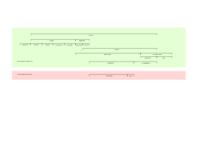

# Asset Balances Model

The idea or purpose of the "balances model" is to define a minimal set of balances that govern an asset. These balances should be chosen in a way so that the UI can show them in a generic way without doing any asset specific calculations. We also define some derivable balances, such that can be calculated in a generic way from the minimal set.

This minimal set should be applicable to all assets that we support and should allow calculating any other amount in the wallet that we need to show to the customer.

The model also defines which fields are returned by the `asset.api.getBalances()` function, which all assets must implement.

## Definitions

**Confirmed amount** - on-chain consensus balance. It may be fetched from a coin node or calculated from transactions or utxos. The meaning of confirmed depends on a specific chain. For most chains we accept one confirmation as confirmed. Some chains such as Monero require more confirmations.

**Unconfirmed amount** - an amount derived from values of pending transactions.

## Balances Model



**Total** (`total`, `balance`) - an optimistic total that we want to show our customer. This optimistic total includes unconfirmed amounts such as received transaction amounts that are not yet confirmed (are still pending). This is the value we most prominently show in the wallet.

**Unconfirmed sent** (`unconfirmedSent`) - cumulative amount of crypto in pending outgoing transactions.

**Unconfirmed received** (`unconfirmedReceived`) - cumulative amount of crypto in pending received transactions.

**Spendable** (`spendable`) - the amount that can be moved out of an account in one or more transactions. Fees are paid from this balance.

**Unspendable** (`unspendable`) - sum of all balances that temporarily cannot be moved. Does not include the frozen balance. (Do we need this? Monero?).

**Stakeable** (`stakeable`, `spendableForStaking`) - the balance that can be spent for staking. Most notably it needs to exclude the walletReserve, so that some funds are left after staking to pay for any unstaking fees.

**Wallet reserve** (`walletReserve`) - amount reserved by the wallet to perform various operations such as unstaking, removing an account, etc.. This reserve is present conditionally. E.g. when we have a staked balance, so that it is possible to pay for an unstaking fee. Examples include Cosmos-like assets, ALGO, SOL, ... The wallet reserve will be zero if the account doesn't have any staking operations active.

**Network reserve** (`networkReserve`) - amount reserved by the network (XRP, XLM, DOT).

**Staking** (`staking`) - In the process of being staked and is possibly not yet accumulating rewards. For most assets staking is immediate, so this value doesn't apply.

**Staked** (`staked`) - Staked and earning rewards.

**Unstaking** (`unstaking`) - In the process of being unstaked. While unstaking the asset may or may not continue accumulating rewards.

**Unstaked** (`unstaked`, `unclaimedUnstaked`) - Unstaked and waiting to be claimed. If claiming is automatic, then this will always be zero.

**Claimable reward** (`rewards`, `unclaimedRewards`) - Staking rewards that need to be claimed or restaked. The claim/restake may happen automatically or manually.

**Frozen** () - Sum of all balances in all staking stages: `frozen = staking + staked + unstaking + unstaked`. However if an asset allows sending staked amounts, frozen will be zero (XTZ).

**Available** (`availableBalance`) - the maximum amount that can be moved out of an account in one transaction excluding any fees that need to be paid. This amount is calculated by the wallet. The reason for that is that the fee needs to be calculated first. The fee may be different depending on the type of transaction or network circumstances.

**Reserved** () - Sum of the wallet reserve and network reserve.

**Unconfirmed** () - Sum of unconfirmed sent and received.

## Balances representation

```
{
    total, // total
    unconfirmedSent,
    unconfirmedReceived,
    spendable,
    unspendable,
    stakeable,
    walletReserve,
    networkReserve,
    staking,
    staked,
    unstaking,
    unstaked,
    rewards,
    frozen,
} = asset.api.getBalances({ accountState, txLog })
```

Deriveable amounts:

`reserved = walletReserve + networkReserve`

`available = spendable - fee`

`unconfirmed = unconfirmedReceived + unconfirmedSent`

## Questions

1. Should we have all assets (including tokens) implement `asset.api.getBalances`? Or should it be limited to the base asset?
2. Currently we use `unspendable` inconsistently. Especially in the staking code. I propose we use `frozen` for staking amounts that are "unspendable" and use `unspenadble` for the original purpose -- temporarily unavailable for spending.
3. What is missing in the model?

## Asset examples

### Bitcoin

```
{
    balance, // from utxos, includes confirmed balance and unconfirmed received amounts
    unconfirmedSent, // from txLog + utxos
    unconfirmedReceived, // from txLog + utxos
    spendable: balance, // may also contain unconfirmed received utxos values
    unspendable, // utxos used by inscriptions or BRC20 transfers, unconfirmed utxos in some cases, ...
}
```

### Elrond

We receive the on-chain balance using an RPC call. All received amounts are final, so we don't have pending unconfirmed transactions. The spendable balance simply equals the on-chain balance.

```
{
  balance, // RPC
  unconfirmedSent, // unconfirmed sent txs from txLog
  spendable: balance,
}
```

### EOS

We get many values from the network, including: `totalBalance`, `liquidBalance`, `refundBalance`

```
{
  balance: totalBalance,
  unconfirmedSent, // from txLog
  spendable: liquidBalance,
  walletReserve: staked || unstaking || unstaked ? RESERVE : ZERO,
  staked: totalBalance - liquidBalance - refundBalance,
  unstaking, // from txLog,
  unstaked: refundBalance,
}
```

### Ethereum

We get several staking related amounts: `unclaimedUndelegatedBalance`, `delegatedBalance`, `rewardsBalance`, `withdrawable`.

```
{
    balance, // from txLog, includes confirmed balance and unconfirmed received amounts
    unconfirmedSent, // from txLog
    unconfirmedReceived, // from txLog
    spendable: balance,
    walletReserve,
    staking,
    staked: delegatedBalance,
    unstaking,
    unstaked: withdrawable,
    rewards: rewardsBalance,
}
```

### Hedera

We fetch the on-chain balance once, when the monitor starts up for the first time. We also fetch all transactions and calculate an `initialBalance` as a difference between the on-chain balance and the txLog balance: `initialBalance = onChainBalance - txLogBalance`.

Received amounts are final, we don't have `unconfirmedReceived`.

```
{
  balance, // from txLog, includes confirmed balance and unconfirmed received amounts
  unconfirmedSent, // unconfirmed sent txs from txLog
  spendable: balance,
}
```
