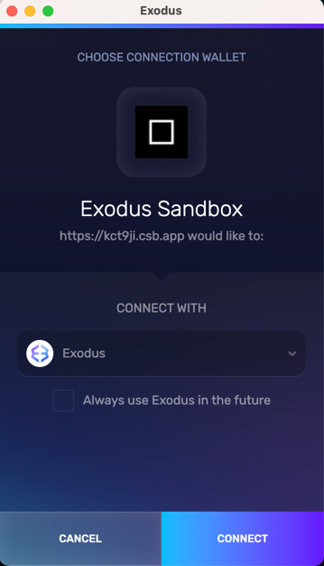
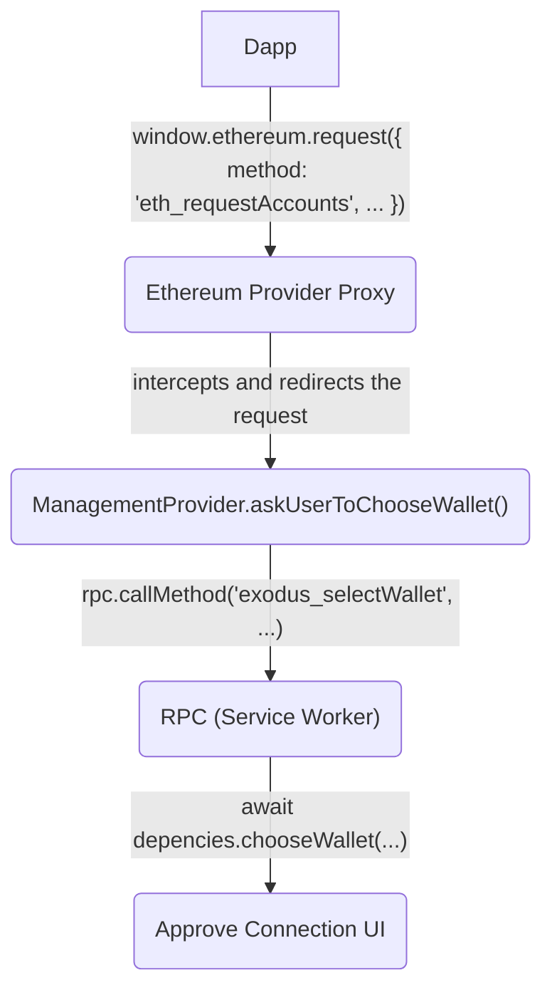

# @exodus/web3-management

Apps connectivity library for Exodus management.

## Usage

```js
const EventEmitter = require('events')

// Separate entry points are supported
const { ManagementProvider } = require('@exodus/web3-management/provider')
const { registerRPCHandlers } = require('@exodus/web3-management/rpc')

// Create transport.
const transport = new EventEmitter()
transport.write = (data) => {
  setTimeout(() => {
    transport.emit('data', data)
  })
}

// Create Exodus global API.
const accountsObservable = new Observable()

const exodus = {
  management: new ManegementProvider({
    transport,
  }),
}

// Inject the Exodus object into the app.
window.exodus = exodus

// Register RPC handlers for requests the Provider can call.
registerRPCHandlers({
  transport,
  deps: {}, // required deps
})
```

## Use cases

### Wallet selector feature



To improve code reusability the feature works by utilizing the separate
`ManagementProvider` class and its own RPC, which are both asset-agnostic.

Here's a high-level data flow chart (Ethereum Provider is used as an example):


